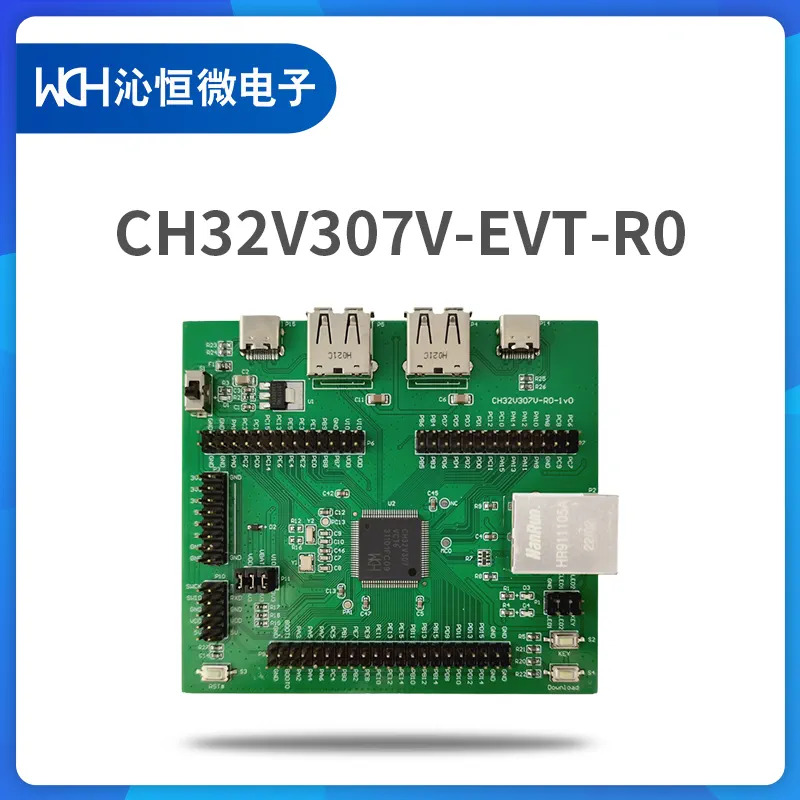

.. _ch32v307v_evt:

WCH CH32V307V-EVT
##########################

Overview
********

The CH32V307V-EVT board is a hardware platform that enables prototyping
on CH32V307V RISC-V MCU. The CH32V30x series is based on QingKe V4F 
microprocessor design, supports single-precision floating-point instruction 
and fast interrupt response, supports 144MHz main frequency zero-wait 
operation, provides 8 groups of U(S)ART, 4 groups of motor PWM advanced 
timers, SDIO, DVP, 4 groups of analog OPA, dual ADC units, dual DAC units, 
built-in USB2.0 high-speed PHY transceivers (480Mbps), Gigabit Ethernet MAC 
and 10M PHY transceivers.

Hardware
********

- CH32V307VCT6 MCU
- 2 x User LEDs
- 1 x User Push Button
- USB FS OTG/Device connector
- USB HS OTG/Device connector
- WCH-Link on board
- SWD Debug interface
- Ethernet connector

For more information about the CH32V307V SoC and CH32V307V-EVT board:

- `WCH RISC-V MCU+ Website`_
- `CH32V307V Datasheet`_
- `CH32V307V User Manual`_
- `CH32V307V-EVT Documents`_

Supported Features
==================

The board configuration supports the following hardware features:

.. list-table::
   :header-rows: 1

   * - Peripheral
     - Kconfig option
     - Devicetree compatible
   * - GPIO
     - :kconfig:option:`CONFIG_GPIO`
     - :dtcompatible:`wch,ch32-gpio`
   * - Machine timer
     - :kconfig:option:`CONFIG_RISCV_MACHINE_TIMER`
     - :dtcompatible:`riscv,machine-timer`
   * - PWM
     - :kconfig:option:`CONFIG_PWM`
     - :dtcompatible:`wch,ch32-pwm`
   * - USART
     - :kconfig:option:`CONFIG_SERIAL`
     - :dtcompatible:`wch,ch32-usart`
   * - ADC
     - :kconfig:option:`CONFIG_ADC`
     - :dtcompatible:`wch,ch32-adc`

Serial Port
===========

The CH32V307V-EVT board has a debug serial communications port. The default port
is USART1 with TX connected at PA9 and RX at PA10.

Programming and Debugging
*************************

Before programming your board make sure to configure boot and serial jumpers
as follows:

- S4 default status, pull down(boot from program flash memory)
- S4 push down, pull up(boot from system memory)

Using WCH-Link
=============

The CH32V307V-EVT includes an onboard programmer/debugger (WCH-Link) which
allows flash programming and debugging over USB.

#. Build the Zephyr kernel and the :ref:`hello_world` sample application:

   .. zephyr-app-commands::
      :zephyr-app: samples/hello_world
      :board: ch32v307v_evt
      :goals: build
      :compact:

#. Run your favorite terminal program to listen for output. On Linux the
   terminal should be something like ``/dev/ttyUSB0``. For example:

   .. code-block:: console

      minicom -D /dev/ttyUSB0 -o

   The -o option tells minicom not to send the modem initialization
   string. Connection should be configured as follows:

      - Speed: 115200
      - Data: 8 bits
      - Parity: None
      - Stop bits: 1

#. To flash an image:

   .. zephyr-app-commands::
      :zephyr-app: samples/hello_world
      :board: ch32v307v_evt
      :goals: flash
      :compact:

   You should see "Hello World! ch32v307v_evt" in your terminal.

#. To debug an image:

   .. zephyr-app-commands::
      :zephyr-app: samples/hello_world
      :board: ch32v307v_evt
      :goals: debug
      :compact:

.. _WCH RISC-V MCU+ SoC Website:
   https://wch-ic.com/products/categories/47.html?pid=5/

.. _CH32V307V Series Datasheet:
   https://wch-ic.com/downloads/CH32V20x_30xDS0_PDF.html/

.. _CH32V307V Series User Manual:
   https://wch-ic.com/downloads/CH32FV2x_V3xRM_PDF.html/

.. _CH32V307V-EVT Documents:
   https://www.wch.cn/downloads/CH32V307EVT_ZIP.html/